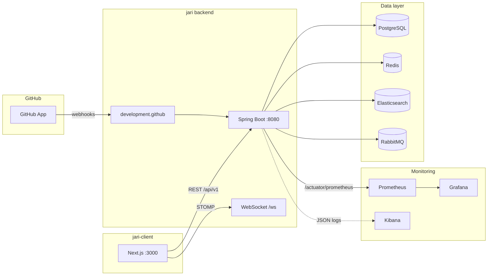
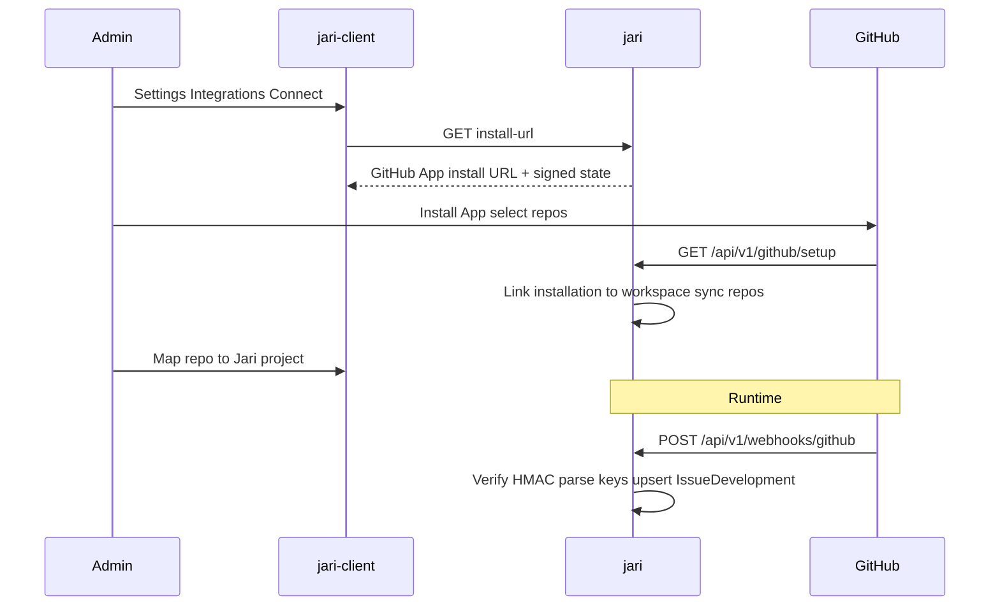

# Jari

[](https://openjdk.org/projects/jdk/17/)
[](https://spring.io/projects/spring-boot)
[](https://www.postgresql.org/)
[](https://github.com/phihocnguyen/jari-client)

```
     ██╗ █████╗ ██████╗ ██╗
     ██║██╔══██╗██╔══██╗██║
     ██║███████║██████╔╝██║
██   ██║██╔══██║██╔══██╗██║
╚█████╔╝██║  ██║██║  ██║██║
 ╚════╝ ╚═╝  ╚═╝╚═╝  ╚═╝╚═╝
```

**Open-source issue tracking platform — backend API.**

Jari is a self-hosted, Jira-inspired project management backend. It exposes a REST API for workspaces, projects, issues, sprints, boards, and notifications, with Redis caching, Elasticsearch-powered search, real-time WebSocket updates, and a full observability stack for production-style benchmarking.

**Frontend:** [jari-client](https://github.com/phihocnguyen/jari-client) (Next.js)

**Support:** macOS, Linux (primary dev targets)

---

## Features

- **Workspaces & projects** — multi-tenant hierarchy with RBAC, members, and project settings
- **Issues** — create, filter, assign, label, link to components/releases, full history and comments
- **Agile boards** — Kanban board, backlog, active sprint management, drag-and-drop ordering
- **Dashboard summary** — status/priority/type breakdowns, team workload, recent activity, epic progress
- **Search** — Elasticsearch index for fast issue filtering; PostgreSQL fallback when ES is unavailable
- **Caching** — Redis-backed `@Cacheable` on read-heavy endpoints (ref data, issue list/detail, board, summary) with Micrometer hit/miss metrics
- **Real-time** — STOMP WebSocket for notifications and project presence
- **Auth** — JWT access/refresh tokens, optional Google OAuth2
- **Automation** — rule hooks on issue status changes with audit logs
- **Development** — link branches/commits/PRs to issues; GitHub App auto-links by issue key
- **Observability** — Prometheus metrics, Grafana dashboards (API latency + cache hit rate), ELK log pipeline
- **Load testing** — k6 scenarios for smoke, stress, and capacity discovery

---

## Architecture



| Layer      | Technology                                             |
| ---------- | ------------------------------------------------------ |
| API        | Spring Boot 4.1, Java 17, Spring Security, MapStruct   |
| Database   | PostgreSQL 16, Flyway migrations, HikariCP             |
| Cache      | Redis 7, Jackson JSON serialization                    |
| Search     | Elasticsearch (Spring Data ES + Logstash JDBC indexer) |
| Messaging  | RabbitMQ (async notifications)                         |
| Metrics    | Micrometer, Prometheus, Grafana                        |
| Logs       | Logstash, Filebeat, Kibana (optional)                  |
| Load tests | k6                                                     |

---

## Quick Start

### Prerequisites

- Java 17+
- Maven 3.9+
- Docker & Docker Compose
- Node.js 20+ (for frontend — see [jari-client](https://github.com/phihocnguyen/jari-client))

### 1. Start infrastructure

```bash
git clone https://github.com/phihocnguyen/jari.git
cd jari

cp .env.example .env   # optional — defaults work for local dev
docker compose up -d
```

This starts **PostgreSQL**, **Redis**, and **RabbitMQ**.

| Service    | URL / Port                                                 |
| ---------- | ---------------------------------------------------------- |
| PostgreSQL | `localhost:5432` — db/user/pass: `jari`                    |
| Redis      | `localhost:6379`                                           |
| RabbitMQ   | AMQP `5672`, UI http://localhost:15672 (`guest` / `guest`) |

### 2. Start the backend

```bash
./mvnw spring-boot:run
```

| Endpoint   | URL                                       |
| ---------- | ----------------------------------------- |
| API base   | http://localhost:8080/api/v1              |
| Swagger UI | http://localhost:8080/swagger-ui.html     |
| Health     | http://localhost:8080/actuator/health     |
| Prometheus | http://localhost:8080/actuator/prometheus |

On first run with Spring profile `dev` (`SPRING_PROFILES_ACTIVE=dev`), **DevDataInitializer** seeds a workspace (`ACME`) and project (`TIS`). Register or log in via `/api/v1/auth` before calling protected APIs.

### 3. Link the frontend (jari-client)

The frontend lives in a **separate repository** and talks to this backend over HTTP and WebSocket.

```bash
git clone https://github.com/phihocnguyen/jari-client.git
cd jari-client
npm install
```

Create `.env.local` in the frontend root:

```bash
# REST API (must include /api/v1)
NEXT_PUBLIC_API_URL=http://localhost:8080/api/v1

# WebSocket (STOMP over SockJS)
NEXT_PUBLIC_WS_URL=http://localhost:8080/ws

# Use real API (set to true only for offline demo mode)
NEXT_PUBLIC_USE_MOCK=false
```

Start the frontend:

```bash
npm run dev
```

Open http://localhost:3000

**CORS** — the backend allows `http://localhost:3000` by default (`CORS_ORIGINS` in `.env` or `application.yaml`). For a custom frontend port:

```bash
export CORS_ORIGINS=http://localhost:3000,http://localhost:3001
```

**Auth** — APIs require a JWT (except `/api/v1/auth/**`, OAuth2, actuator health, and GitHub webhooks). Register/login to obtain tokens, or use Google OAuth when enabled.

**OAuth2 Google** — set `GOOGLE_CLIENT_ID` / `GOOGLE_CLIENT_SECRET` and `app.security.oauth2-enabled=true`; the OAuth callback redirects to `http://localhost:3000/auth/callback`.

---

## Development panel & GitHub App

Issue **Development** links (branch / commit / pull request) live in `issue_developments` and are exposed via:

| Method | Path | Purpose |
| ------ | ---- | ------- |
| `GET` | `/api/v1/issues/{id}/developments` | List links on an issue |
| `POST` | `/api/v1/issues/{id}/developments` | Manual link |
| `DELETE` | `/api/v1/developments/{id}` | Unlink |

GitHub App automation lives under `com.example.jari.development.github` and fills the same table when a mapped repo emits events whose title, branch, or commit message contains an issue key (e.g. `APP-1`).



### Setup

1. Create a GitHub App with permissions: **Contents** (Read), **Metadata** (Read), **Pull requests** (Read).  
   Subscribe to events: `Installation`, `Installation repositories`, `Push`, `Create`, `Pull request`.
2. **Webhook URL:** `https://<public-host>/api/v1/webhooks/github` (ngrok / Cloudflare Tunnel locally).
3. **Setup URL:** `https://<public-host>/api/v1/github/setup`
4. Env vars: `GITHUB_APP_ID`, `GITHUB_APP_SLUG`, `GITHUB_APP_PRIVATE_KEY`, `GITHUB_WEBHOOK_SECRET`, `GITHUB_APP_CLIENT_ID`, `GITHUB_APP_CLIENT_SECRET`, `FRONTEND_BASE_URL`.
5. In the UI: **Workspace Settings → Integrations → Connect GitHub**, then map each repo to a project.
6. Smoke test: branch `feature/APP-1-x`, commit `APP-1 msg`, PR title `APP-1 …` → appear on ticket Development panel.

**Local tunnel (ngrok in Docker)** — expose host `:8080` without installing ngrok on the machine:

```bash
# 1. Put token in .env  (https://dashboard.ngrok.com/get-started/your-authtoken)
NGROK_AUTHTOKEN=...

# 2. Start Spring Boot on the host (port 8080), then:
docker compose --profile tunnel up -d ngrok

# 3. Copy the https URL from:
#    http://localhost:4040   or   docker compose logs ngrok
# Use it as GitHub App Webhook + Setup URL base, e.g.:
#    https://xxxx.ngrok-free.app/api/v1/webhooks/github
#    https://xxxx.ngrok-free.app/api/v1/github/setup
```

Also set `BACKEND_BASE_URL` to that https URL if you rely on it in docs/callbacks.

### Admin APIs

| Method | Path | Purpose |
| ------ | ---- | ------- |
| `GET` | `/api/v1/workspaces/{id}/github/install-url` | Start App install |
| `GET` | `/api/v1/workspaces/{id}/github/installations` | List installs + repos |
| `PUT` | `/api/v1/workspaces/{id}/github/repos/{repoId}` | Map/unmap `{ "projectId": "…" }` |
| `DELETE` | `/api/v1/workspaces/{id}/github/installations/{id}` | Disconnect install |
| `POST` | `/api/v1/webhooks/github` | GitHub webhook (HMAC, public) |
| `GET` | `/api/v1/github/setup` | Post-install redirect callback |

Webhook events → development types: `create` (branch) → `BRANCH`, `push` → `COMMIT`, `pull_request` → `PULL_REQUEST` (status `OPEN` / `MERGED` / `CLOSED`).

---

## Configuration

Copy and adjust environment variables:

```bash
cp .env.example .env
```

| Variable                    | Default                                 | Description                                |
| --------------------------- | --------------------------------------- | ------------------------------------------ |
| `DB_URL`                    | `jdbc:postgresql://localhost:5432/jari` | PostgreSQL JDBC URL                        |
| `DB_USER` / `DB_PASS`       | `jari`                                  | Database credentials                       |
| `REDIS_HOST` / `REDIS_PORT` | `localhost` / `6379`                    | Redis cache                                |
| `ELASTICSEARCH_URIS`        | `http://localhost:9200`                 | ES for issue search                        |
| `RABBITMQ_*`                | `guest` / `guest`                       | Message broker                             |
| `JWT_SECRET`                | dev default                             | JWT signing key — **change in production** |
| `CORS_ORIGINS`              | `http://localhost:3000`                 | Allowed frontend origins                   |
| `SPRING_PROFILES_ACTIVE`    | —                                       | Set `docker` for JSON logs → ELK           |
| `GITHUB_APP_ID`             | —                                       | GitHub App ID                              |
| `GITHUB_APP_CLIENT_ID`      | —                                       | GitHub App client ID                       |
| `GITHUB_APP_CLIENT_SECRET`  | —                                       | GitHub App client secret                   |
| `GITHUB_APP_PRIVATE_KEY`    | —                                       | PEM private key (`\n` escaped OK)          |
| `GITHUB_WEBHOOK_SECRET`     | —                                       | Webhook HMAC secret                        |
| `GITHUB_APP_SLUG`           | —                                       | App slug for install URL                   |
| `FRONTEND_BASE_URL`         | `http://localhost:3000`                 | Post-install redirect target               |
| `BACKEND_BASE_URL`          | `http://localhost:8080`                 | Public API base (docs / tunnels)           |

Key settings in `src/main/resources/application.yaml`:

```yaml
app:
  security:
    oauth2-enabled: true

spring:
  cache:
    redis:
      time-to-live: 300000 # 5 minutes
      enable-statistics: true # cache hit/miss metrics
```

---

## API Overview

All routes are under `/api/v1` unless noted.

| Area          | Examples                                                        |
| ------------- | --------------------------------------------------------------- |
| Auth          | `POST /auth/login`, `POST /auth/register`, `POST /auth/refresh` |
| Workspaces    | `GET/POST /workspaces`, members, settings                       |
| Projects      | `GET/POST /workspaces/{id}/projects`, members                   |
| Issues        | CRUD, filters, labels, watchers, history, comments              |
| Sprints       | planning, active sprint, board, backlog reorder                 |
| Summary       | `GET /projects/{id}/summary`                                    |
| Reference     | `GET /ref/issue-types`, `/ref/statuses`, `/ref/priorities`      |
| Notifications | inbox, mark read                                                |
| Development   | issue developments CRUD; GitHub App install, map, webhooks      |
| WebSocket     | `/ws` — STOMP topics for notifications & presence               |

Interactive docs: http://localhost:8080/swagger-ui.html

---

## Caching

Read-heavy endpoints use Spring Cache backed by Redis:

| Cache name        | Endpoint pattern                                   |
| ----------------- | -------------------------------------------------- |
| `ref:*`           | Reference data (issue types, statuses, priorities) |
| `issue:list`      | Paginated issue list                               |
| `issue:detail`    | Single issue by ID or key                          |
| `project:board`   | Active sprint board                                |
| `project:summary` | Project dashboard metrics                          |

Cache hit rate is exposed via Micrometer (`cache_gets_total{result="hit|miss"}`) and visualized in Grafana.

After changing cache serialization or DTOs, flush Redis before retesting:

```bash
redis-cli FLUSHDB
```

---

## Load Testing (k6)

Benchmark scripts live in `k6/`.

```bash
cp k6/.env.example k6/.env
cd k6

./run.sh benchmark.js   # smoke + read dashboard + mixed workload
./run.sh load.js        # fixed stress (configure VUs / RPS in k6/.env)
./run.sh capacity.js    # stepped capacity discovery
```

Example stress profile (`k6/.env`):

```bash
BASE_URL=http://localhost:8080
K6_LOAD_MODE=vus
K6_CONCURRENT_USERS=1000
K6_LOAD_DURATION=10m
```

**Reference benchmark** (local, single JVM, read-only dashboard, 7 cached endpoints):

| Metric               | Result                                     |
| -------------------- | ------------------------------------------ |
| Concurrent users     | 1,000 VU                                   |
| HTTP throughput      | ~1,806 req/s                               |
| Total requests       | ~1.25M (11.5 min run)                      |
| Error rate           | 0%                                         |
| p95 / p99 latency    | ~993 ms / ~1.19 s                          |
| Redis cache hit rate | **~99.99%** on `@Cacheable` endpoints only |

> Latency and throughput reflect a **single-node local** setup. Production with horizontal scaling will differ.

---

## Monitoring

Full stack in `monitoring/`:

```bash
cd monitoring
cp .env.example .env
docker compose up -d
```

| Service        | URL                   | Purpose                                                  |
| -------------- | --------------------- | -------------------------------------------------------- |
| **Grafana**    | http://localhost:3001 | API req/s, p95 latency, **Redis cache hit rate** (UTC+7) |
| **Prometheus** | http://localhost:9090 | Metrics engine (UTC)                                     |
| **Kibana**     | http://localhost:5601 | Error & request logs                                     |

See [monitoring/README.md](monitoring/README.md) for ELK setup, PromQL examples, and benchmark workflow.

---

## Project Structure

```
jari/
├── src/main/java/com/example/jari/
│   ├── issue/          # Issues, comments, history, summary, search
│   ├── sprint/         # Sprints, board, backlog
│   ├── project/        # Projects, members, presence
│   ├── workspace/      # Workspaces, RBAC
│   ├── reference/      # Issue types, statuses, priorities
│   ├── notification/   # In-app + async notifications
│   ├── automation/     # Issue automation rules
│   └── shared/         # Config, cache, security, exceptions
├── src/main/resources/
│   ├── application.yaml
│   └── db/migration/   # Flyway SQL
├── docker-compose.yml  # Postgres, Redis, RabbitMQ
├── k6/                 # Load & capacity tests
└── monitoring/         # Prometheus, Grafana, ELK
```

**Related repository:**

| Repo                                                       | Role                    |
| ---------------------------------------------------------- | ----------------------- |
| [jari](https://github.com/phihocnguyen/jari)               | Backend API (this repo) |
| [jari-client](https://github.com/phihocnguyen/jari-client) | Next.js frontend        |

---

## Development

```bash
# Run unit tests
./mvnw test

# Run tests + enforce JaCoCo branch coverage gate (≥ 70%)
./mvnw verify

# Compile only
./mvnw compile -DskipTests

# Run the API (JWT required on protected routes)
./mvnw spring-boot:run

# Optional demo seed data
SPRING_PROFILES_ACTIVE=dev ./mvnw spring-boot:run
```

### Testing & coverage

Unit tests use **JUnit 5 + Mockito**. Integration test (`JariApplicationTests`, Testcontainers) is tagged `@Tag("integration")` and excluded from default `./mvnw test`.

**JaCoCo report** (generated after `./mvnw test`):

|                 |                                                                  |
| --------------- | ---------------------------------------------------------------- |
| HTML report     | [`target/site/jacoco/index.html`](target/site/jacoco/index.html) |
| CSV (scripting) | `target/site/jacoco/jacoco.csv`                                  |

```bash
# Regenerate report
./mvnw test

# Open report (Linux)
xdg-open target/site/jacoco/index.html
```

**Current metrics** (unit tests only, local run):

| Metric               | All classes    | Business logic\*                          |
| -------------------- | -------------- | ----------------------------------------- |
| Unit tests           | **173** passed | —                                         |
| Branch coverage      | 39%            | **72%**                                   |
| Line coverage        | 47%            | **93%**                                   |
| Instruction coverage | 46%            | —                                         |
| CI gate              | —              | `./mvnw verify` requires **≥ 70% branch** |

\*Business logic scope: services, specs, exception handlers, cache helpers, search — excludes entity/DTO/mapper/config/controller/security, messaging consumers, and hard-to-unit-test services (`SummaryService`, `NotificationService`, `IssueIndexService`). See `jacoco-maven-plugin` excludes in `pom.xml`.

**Typical local workflow:**

1. `docker compose up -d` — infra
2. `./mvnw spring-boot:run` — backend on `:8080`
3. `cd ../jari-client && npm run dev` — frontend on `:3000`
4. Optional: `cd monitoring && docker compose up -d` — Grafana during k6 runs

---

## Resources

- [JaCoCo coverage report](target/site/jacoco/index.html) — branch/line coverage (run `./mvnw test` first)
- [monitoring/README.md](monitoring/README.md) — Grafana, Prometheus, Kibana, cache metrics
- [k6/.env.example](k6/.env.example) — load test configuration
- [Swagger UI](http://localhost:8080/swagger-ui.html) — live API docs (when backend is running)

---

## License

See repository for license information.
